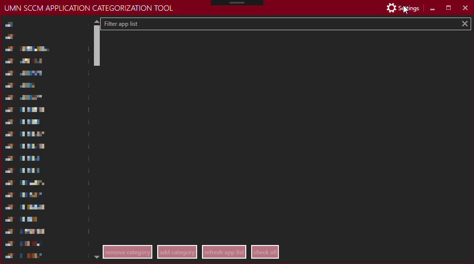

# UMN-SCCMApplicationCategorization

This allows for the easy management of application catagories in SCCM.

## Table of Contents

- [UMN-SCCMApplicationCategorization](#umn-sccmapplicationcategorization)
  - [Table of Contents](#table-of-contents)
  - [Build Status](#build-status)
  - [Usage](#usage)
    - [Installation Instructions](#installation-instructions)
    - [Setup](#setup)

## Build Status

## Usage

### Installation Instructions

Copy the following files into the folder where the application executable is:
 * The following are from C:\Program Files (x86)\Microsoft Configuration Manager\AdminConsole\bin
    * AdminUI.WqlQueryEngine.dll
    * DcmObjectModel.dll
    * Microsoft.ConfigurationManagement.ApplicationManagement.dll
    * Microsoft.ConfigurationManagement.ManagementProvider.dll
    * Microsoft.ConfigurationManager.CommonBase.dll

Once copied over you should be able to launch and use the applicaiton.

### Setup

Once you've launched the application, you'll need to go to settings and enter in your site servers fully qualified domain name (fqdn) so that the application can talk with your site.